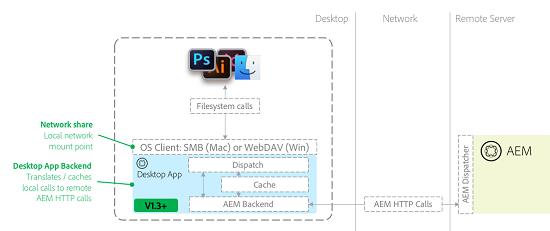

# AEM Prácticas recomendadas para la aplicación de escritorio v1.10 {#aem-desktop-app-best-practices}

## Información general {#overview}

[!DNL Adobe Experience Manager] AEM La aplicación de escritorio vincula su solución de administración de activos digitales (DAM) con su escritorio para que pueda abrir los archivos disponibles en la interfaz de usuario de la web de la directamente en el escritorio. AEM Si guarda un recurso desde el escritorio, se cargará en la ubicación adecuada, a la que se cargará el recurso en el lugar que corresponda.

AEM AEM La aplicación de escritorio de elimina las posibilidades de actualizar copias locales incorrectas o de actualizar un recurso incorrecto en la. el flujo de trabajo fácil de usar de la aplicación de escritorio se habilita mediante la tecnología de uso compartido de red que proporcionan los sistemas operativos de escritorio.

La aplicación de escritorio monta el repositorio de AEM Assets como un recurso compartido de red en el escritorio. Por lo tanto, las carpetas y archivos aparecen como si fueran locales. Sin embargo, no se recomienda realizar operaciones de administración de recursos digitales directamente desde el escritorio en el recurso compartido de red montado en Finder o Explorer. En su lugar, Adobe recomienda utilizar la interfaz de usuario web de AEM Assets para realizar operaciones como copiar o mover un gran número de recursos.

>[!NOTE]
>
>Antes de leer este documento, puede revisar el [AEM Prácticas recomendadas de integración de Creative Cloud y](https://experienceleague.adobe.com/docs/experience-manager-65/assets/administer/aem-cc-integration-best-practices.html) para obtener una descripción general de nivel superior del tema.

## AEM arquitectura de aplicación de escritorio de {#aem-desktop-app-architecture}

AEM La aplicación de escritorio de utiliza recursos compartidos de red WebDAV (Windows) o SMB (Mac) para montar recursos compartidos de red. El recurso compartido de red montado es solo local. AEM La aplicación de escritorio de intercepta las llamadas (abre, lee y escribe) y proporciona almacenamiento en caché local adicional. Traduce llamadas remotas al servidor de AEM Assets AEM para solicitudes HTTP optimizadas de la. AEM En el diagrama siguiente se muestra la arquitectura de la aplicación de escritorio de la.

*Figura: arquitectura de la aplicación de escritorio*

El almacenamiento en caché adicional durante la escritura cuando se guarda un archivo hace que el archivo se guarde primero localmente (de modo que el usuario no espere a la transferencia de red). AEM AEM A continuación, después de un retraso predefinido (30 segundos), el archivo se carga en el segundo plano y, a continuación, el recurso se carga en el segundo plano, en el que se carga el archivo a la. AEM La aplicación de escritorio de proporciona una interfaz de usuario para monitorizar el estado de las cargas de archivos en segundo plano.

## AEM Uso recomendado de la aplicación de escritorio de {#recommended-use-of-aem-desktop-app}

AEM Entre las funcionalidades clave de la aplicación de escritorio de se incluyen:

* **Abrir archivos desde la IU web de AEM Assets en el escritorio**. Desde la interfaz de usuario web, puede mostrar recursos en el escritorio (en Finder, Explorer) o abrir un recurso mediante una aplicación de escritorio.

* **Salida y entrada**. Los recursos se pueden retirar para editarlos y se marcan como bloqueados para el usuario en AEM Assets. Después de la edición, el recurso se puede registrar para desbloquearlo.

* **Guardar cambios en archivos**. AEM Cualquier cambio que guarde en el archivo en el recurso compartido de red se cargará automáticamente en el recurso compartido de red y se creará una nueva versión.

* **Colocar recursos vinculados en otros documentos**. En aplicaciones, como Creative Cloud ([!DNL Adobe Photoshop], [!DNL Adobe InDesign], y [!DNL Adobe Illustrator]), puede colocar un archivo externo como vínculo. Por ejemplo, puede colocar una imagen en un documento de InDesign. AEM En este caso, el montaje del recurso compartido de red le permite examinar y seleccionar los recursos de la lista de recursos que desea colocar en la lista de distribución de recursos La colocación de archivos vinculados también funciona en algunas aplicaciones que no son de Adobe, como MS Office.

* **AEM Resolución de referencia en el**. AEM Si tanto los archivos colocados como los archivos principales con vínculo se almacenan en el, se puede proporcionar automáticamente información del lado del servidor acerca de las referencias de recursos en el servidor.

* **Acceder al recurso desde el escritorio**. En el recurso compartido de red montado, un menú contextual proporciona un [!UICONTROL More Info] AEM (vista previa más grande, metadatos clave) y la capacidad de abrir un recurso en la interfaz de usuario de la interfaz de usuario de.

* **Carga masiva de carpetas jerárquicas de gran tamaño**. AEM AEM AEM Si utiliza la opción Crear > Cargar carpeta en la interfaz de usuario de la interfaz de usuario de la interfaz de usuario para cargar recursos, la aplicación de escritorio carga la jerarquía de carpetas seleccionada para que se cargue en segundo plano, de forma que se cargue en segundo plano. El progreso de carga se puede monitorizar con una interfaz de usuario dedicada en la aplicación de escritorio.

## AEM Uso inapropiado de la aplicación de escritorio de la {#inappropriate-use-of-aem-desktop-app}

* AEM No utilice la aplicación de escritorio de para administrar recursos desde el escritorio. AEM La aplicación de escritorio no se creó como reemplazo de las unidades de red. En su lugar, utilice las siguientes funciones:

   * IU web de AEM Assets para la administración de recursos digitales (buscar o compartir recursos, metadatos y copiar o mover).

   * AEM aplicación de escritorio de [!UICONTROL Folder Upload] para cargar carpetas grandes y jerárquicas.

* AEM No trate a la aplicación de escritorio de como un cliente de &quot;sincronización de escritorio&quot; para AEM Assets. AEM La principal ventaja de la aplicación de escritorio de aquí es que proporciona acceso &quot;virtual&quot; a todo el repositorio, y las aplicaciones de sincronización de escritorio suelen sincronizar solo los recursos que pertenecen a un usuario. AEM La aplicación de escritorio proporciona cierto nivel de almacenamiento en caché y carga en segundo plano; aun así, funciona de forma muy diferente a las aplicaciones de &quot;sincronización&quot; típicas, como la aplicación de escritorio de Adobe Creative Cloud o Microsoft OneDrive.

* AEM No utilice las unidades de red de aplicaciones de escritorio de la aplicación para guardar recursos con frecuencia. Todas las operaciones de guardado se transmiten a AEM Assets. Por lo tanto, no es práctico realizar operaciones de edición intensivas directamente en el repositorio de AEM Assets montado. La edición de un recurso directamente en el repositorio montado saturará la cronología del recurso con versiones irrelevantes e impondrá costes generales adicionales al servidor.

* AEM AEM No utilice la aplicación de escritorio de para migrar grandes cantidades de datos de una instancia de escritorio a otra. Consulte la [Guía de migración](https://experienceleague.adobe.com/docs/experience-manager-65/assets/administer/assets-migration-guide.html) para planificar y ejecutar migraciones de recursos. Por el contrario, la aplicación de escritorio [admite la carga masiva](use-app-v1.md#bulkupload) gran número de recursos por primera vez en [!DNL Adobe Experience Manager].

## Recommendations para casos de uso seleccionados {#recommendations-for-selected-use-cases}

### Acceso a los recursos para usuarios creativos {#access-to-assets-for-creative-users}

AEM La aplicación de escritorio de proporciona acceso virtual a todo el repositorio de DAM, y puede ser complicado para los usuarios creativos de escritorio encontrar y acceder a los recursos adecuados en su escritorio. Siga estos procedimientos recomendados para simplificarlos.

* Utilice las funciones de colaboración de la interfaz de usuario web de AEM Assets para proporcionar un acceso más directo a los recursos adecuados para el usuario creativo. Algunas de ellas son compartir carpetas o colecciones, proporcionar colecciones inteligentes (búsquedas guardadas) o enviar notificaciones con punteros a los recursos adecuados. A continuación, los usuarios creativos pueden utilizar acciones del escritorio en la interfaz de usuario web para obtener acceso rápidamente a estos recursos en su escritorio.

* Considere los permisos adecuados para los recursos (control de acceso) para simplificar la vista en el repositorio de DAM para los usuarios creativos, limitando básicamente su acceso a solo los recursos que necesitan o en los que están interesados:

   * Es posible que se denieguen ciertas áreas no relevantes para los usuarios creativos a sus grupos de usuarios para quitarlas de su vista, también en el escritorio.

   * La mayoría de los recursos de DAM son finales y no están pensados para cambiarlos. Deben ser de solo lectura para los usuarios creativos.

   * Solo los recursos que requieran cambios o retoques deben estar habilitados para escritura para los usuarios creativos. AEM Algunas organizaciones utilizan Proyectos de y las carpetas que crean para alojar recursos que aún están sujetos a cambios.

### Buscando recursos {#searching-assets}

Para buscar un archivo que desee abrir en el escritorio:

* Utilice la interfaz de usuario web de AEM Assets para localizar el recurso. La búsqueda en AEM Assets no solo es potente (facetas de búsqueda, búsquedas guardadas), sino que también proporciona funcionalidades adicionales para encontrar el recurso adecuado. Estos incluyen filtros adicionales, como la capacidad de buscar recursos en función del estado (aprobación, caducidad), colecciones, tareas, notificaciones y el uso compartido de carpetas/colecciones con otros usuarios/grupos.

* AEM Una vez localizado el recurso, utilice Acciones de escritorio en la interfaz de usuario de la interfaz de usuario de para acceder al recurso en el escritorio

### AEM Actualizar recursos abiertos mediante la aplicación de escritorio de {#updating-assets-opened-using-aem-desktop-app}

Si edita un recurso directamente en la ubicación asignada desde AEM Assets AEM a un recurso compartido de red local, el recurso se cargará en el servidor de correo electrónico cada vez que lo guarde en el equipo de escritorio. AEM Además, crea una versión y genera representaciones.

AEM Si un recurso almacenado en el necesita una actualización:

* Para **actualizaciones menores**, como solicitudes de retoque menores en el proceso de aprobación:

   * Desproteja el archivo y ábralo en el escritorio.

   * Actualice el archivo.

   * Guarde la versión actualizada. El recurso se actualiza y la cronología muestra la versión original para la comparación.

* Para **actualizaciones importantes**, como una solicitud de cambio que requiere un pequeño ciclo de WIP creativo:

   * Utilice la opción Mostrar para abrir la carpeta adecuada en el escritorio.

   * Copie el archivo en una carpeta de trabajo en curso fuera del recurso compartido de AEM Assets asignado (por ejemplo, copie el archivo en una carpeta sincronizada con la aplicación de escritorio de Adobe Creative Cloud).

   * Trabaje en el archivo y guárdelo intermitentemente. Los cambios no se guardan en AEM Assets.

   * AEM Una vez completadas las ediciones, mueva, copie o guarde el archivo asignado de para cargarlo como una versión nueva.

## Rendimiento de red {#network-performance}

AEM AEM Una buena experiencia para los usuarios que utilizan la aplicación de escritorio de la aplicación de la depende en gran medida de una conectividad de red buena y estable entre sus escritorios y el servidor de la aplicación de escritorio, así como del servidor optimizado para obtener un buen rendimiento, especialmente en lo que respecta a la carga y actualización de recursos. Estas recomendaciones son para los equipos de red/TI de las organizaciones.

### Consideraciones de red {#network-considerations}

Para comprender las prácticas recomendadas sobre la configuración de red de AEM Assets, consulte [Migración de recursos por lotes](https://experienceleague.adobe.com/docs/experience-manager-65/assets/administer/assets-migration-guide.html) documento. AEM Algunos de los aspectos importantes que ayudan a optimizar la experiencia de la aplicación de escritorio de los usuarios son:

* **Utilizar Dispatcher correctamente configurado**. AEM Use Dispatcher para obtener una seguridad adicional y asegúrese de que está configurado para lo siguiente: [AEM AEM Conexión de la aplicación de escritorio de a un distribuidor](install-configure-app-v1.md#connect-to-an-aem-instance-behind-a-dispatcher)

* **Ahorrar ancho de banda**. Considere desactivar la previsualización de iconos en Finder en Mac: al navegar por el repositorio montado mediante Finder. Finder solicita a cada archivo que genere una vista previa y hace que la aplicación de escritorio descargue y almacene en caché el recurso localmente. Tenga en cuenta que, aunque se ahorra ancho de banda, también se reduce la experiencia del usuario en el escritorio, por lo que debe hacerse cuando se trabaja con repositorios con recursos grandes o con un ancho de banda limitado.

>[!NOTE]
>
>Para desactivar las previsualizaciones de iconos, vaya a Finder en [!UICONTROL View], seleccione [!UICONTROL View Options]y, a continuación, desmarque [!UICONTROL Show icon preview] opción. Esto solo funciona para la carpeta actual: para convertirla en predeterminada, haga clic en [!UICONTROL Use as default] en el mismo cuadro de diálogo.

### Optimización del rendimiento del servidor {#optimizing-server-performance}

Para saber cómo se debe optimizar el rendimiento del servidor de AEM Assets, consulte [Guía de ajuste de rendimiento de AEM Assets](https://experienceleague.adobe.com/docs/experience-manager-65/assets/administer/performance-tuning-guidelines.html). AEM Algunos de los aspectos importantes del rendimiento del servidor para la aplicación de escritorio son la optimización de la configuración del flujo de trabajo para que funcione bien en las cargas de recursos:

* **Carga de recursos con mayor rendimiento**. Configure las variables [AEM Modelo de flujo de trabajo de actualización de recursos que se ha configurado como transitorio](https://experienceleague.adobe.com/docs/experience-manager-65/assets/administer/performance-tuning-guidelines.html).

* **Límite de CPU del servidor para cargas**. Asegúrese de que el parámetro de trabajos de flujo de trabajo en paralelo máximo esté configurado correctamente para que las cargas no agoten toda la CPU.
