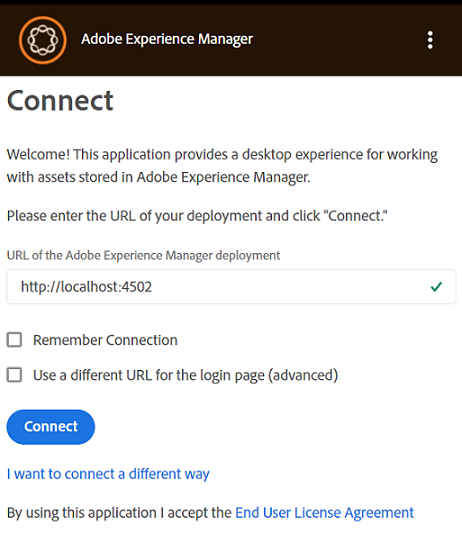
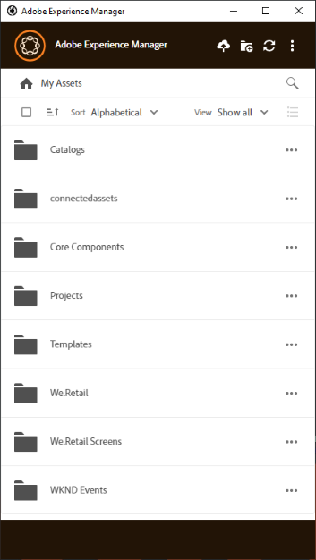

# Instalar [!DNL Adobe Experience Manager] aplicación de escritorio {#install-app-v2}

Uso del [!DNL Adobe Experience Manager] aplicación de escritorio, los recursos dentro de [!DNL Experience Manager] están fácilmente disponibles en su escritorio local y se pueden utilizar en cualquier aplicación de escritorio nativa. Los recursos se pueden previsualizar, abrir en aplicaciones de escritorio nativas, mostrar en el Buscador de Mac o en el Explorador de Windows para colocarlos en otros documentos y cambiar localmente; los cambios se guardan de nuevo en [!DNL Experience Manager] al cargar y se crea una nueva versión en el repositorio.

Esta integración permite que varias funciones de la organización:

* Administre los recursos de forma centralizada en [!DNL Experience Manager Assets].

* Acceda a los recursos en cualquier aplicación de escritorio nativa, incluidas las aplicaciones de terceros y en Adobe Creative Cloud. Al hacerlo, los usuarios pueden adherirse fácilmente a los distintos estándares, incluida la marca.

Para usar [!DNL Experience Manager] aplicación de escritorio:

* Asegúrese de que su [!DNL Experience Manager] La versión de es compatible con [!DNL Experience Manager] aplicación de escritorio. Consulte la [requisitos del sistema](release-notes.md).

* Descargue e instale la aplicación. Consulte [instalar aplicación de escritorio](#install-v2) más abajo.

* Pruebe la conexión con algunos recursos. Consulte [cómo examinar y buscar recursos](using.md#browse-search-preview-assets).

## Requisitos del sistema, requisitos previos y vínculos de descarga {#tech-specs-v2}

Para obtener información detallada, consulte la [[!DNL Experience Manager] notas de la versión de aplicación de escritorio](release-notes.md).

## Actualización desde una versión anterior {#upgrade-from-previous-version}

Si usa la versión 1.x de la aplicación de escritorio, comprenda las diferencias y similitudes entre la versión anterior y la más reciente de la aplicación. Consulte [novedades de la aplicación de escritorio](introduction.md#whats-new-v2) y [funcionamiento de la aplicación](release-notes.md#how-app-works).

>[!NOTE]
>
>Dos versiones de la aplicación de escritorio no pueden coexistir en un equipo. Antes de instalar una versión, desinstale la otra versión.

Para actualizar desde una versión anterior de la aplicación, siga estas instrucciones:

1. Antes de actualizar, sincronice todos los recursos y cargue los cambios en [!DNL Experience Manager]. El objetivo de esto es evitar la pérdida de ediciones al desinstalar la aplicación.

1. Desinstale la versión anterior de la aplicación. Al desinstalar, seleccione la opción para borrar la caché.

1. Reinicie el equipo.

1. [Descargar](release-notes.md) y [instalar](#install-v2) la aplicación más reciente. Siga las instrucciones siguientes.

## Instalar {#install-v2}

Para instalar la aplicación de escritorio, siga estos pasos. Desinstalar cualquier Adobe existente [!DNL Experience Manager] aplicación de escritorio v1.x antes de instalar la aplicación más reciente. Para obtener más información, consulte lo anterior.

1. Descargue el instalador más reciente de [notas de la versión](release-notes.md) página.

1. Mantenga la dirección URL y las credenciales de su [!DNL Experience Manager] implementación práctica.

1. Si actualiza desde otra versión de la aplicación, consulte [actualizar aplicación de escritorio](#upgrade-from-previous-version).

1. Omita este paso si está utilizando [!DNL Experience Manager] as a [!DNL Cloud Service], [!DNL Experience Manager] 6.4.4 o posterior, o [!DNL Experience Manager] 6.5.0 o posterior. Asegúrese de que su [!DNL Experience Manager] La configuración de cumple los requisitos de compatibilidad mencionados en la [notas de la versión](release-notes.md). Si es necesario, descargue el [paquete de compatibilidad](https://experience.adobe.com/#/downloads/content/software-distribution/en/aem.html?package=/content/software-distribution/en/details.html/content/dam/aem/public/adobe/packages/cq640/featurepack/adobe-asset-link-support) e instálelo con el [!DNL Experience Manager] Administrador de paquetes como [!DNL Experience Manager] administrador. Para instalar un paquete, consulte [Cómo trabajar con paquetes](https://experienceleague.adobe.com/docs/experience-manager-65/administering/contentmanagement/package-manager.html?lang=es).

1. Ejecute el binario del instalador y siga las instrucciones que aparecen en pantalla para instalar.

1. En Windows, el instalador puede solicitar la instalación `Visual Studio C++ Redistributable 2015`. Siga las instrucciones que aparecen en pantalla para instalarlo. Si la instalación falla, instálela manualmente. Descargue el instalador desde [aquí](https://www.microsoft.com/en-us/download/details.aspx?id=52685) e instale ambos `vc_redist.x64.exe` y `vc_redist.x86.exe` archivos. Vuelva a ejecutar el [!DNL Experience Manager] instalador de aplicación de escritorio.

1. Reinicie el equipo cuando se le solicite. Inicie y configure la aplicación de escritorio de.

1. Para conectar la aplicación con un [!DNL Experience Manager] repositorio, haga clic en el icono aplicación de la bandeja de entrada e inicie la aplicación. Proporcione la dirección del [!DNL Experience Manager] servidor con el formato `https://[aem_server]:[port]/`.

   Clic **[!UICONTROL Connect]** y proporcione las credenciales.

   

   *Imagen: pantalla de conexión a la dirección del servidor de entrada.*

   Seleccionar **[!UICONTROL Remember Connection]** para evitar introducir los detalles de conexión cada vez que inicie sesión en la aplicación de escritorio.

   >[!CAUTION]
   >
   >Asegúrese de que no haya espacios iniciales o finales antes o después de la dirección del [!DNL Experience Manager] servidor. De lo contrario, la aplicación no se podrá conectar al [!DNL Experience Manager] servidor.

1. Una vez que la conexión se haya realizado correctamente, podrá ver la lista de carpetas y recursos disponibles en la carpeta raíz de [!DNL Experience Manager] DAM. Puede examinar las carpetas desde la aplicación.

   

   *Imagen: la aplicación muestra el contenido de DAM tras el inicio de sesión*

1. ([!DNL Experience Manager] 6.5.1 o posterior) Si utiliza la aplicación de escritorio con [!DNL Experience Manager] 6.5.1 o posterior, actualice el conector S3 o Azure a la versión 1.10.4 o posterior. Consulte [Conector de Azure](https://experienceleague.adobe.com/docs/experience-manager-65/deploying/deploying/data-store-config.html#azure-data-store) o [Conector S3](https://experienceleague.adobe.com/docs/experience-manager-65/deploying/deploying/data-store-config.html#amazon-s-data-store).

   Si es cliente de Adobe Managed Services (AMS), póngase en contacto con el Servicio de atención al cliente de Adobe.

## Definir preferencias {#set-preferences}

Para cambiar las preferencias, haga clic en  y **[!UICONTROL Preference]** . En el **[!UICONTROL Preferences]** , ajuste los valores de lo siguiente:

* [!UICONTROL Launch application on login].

* [!UICONTROL Show window when application starts].

* **[!UICONTROL Cache Directory]**: ubicación de la caché local de la aplicación (contiene los recursos descargados localmente).

* **[!UICONTROL Network Drive Letter]**: la letra de unidad utilizada para asignar al [!DNL Experience Manager] DAM. No cambie esto si no está seguro. La aplicación puede asignarse a cualquier letra de unidad en Windows. Si dos usuarios colocan recursos de letras de unidad diferentes, no podrán ver los recursos que el otro ha colocado. La ruta de los recursos cambia. Los recursos permanecen colocados en el archivo binario (por ejemplo, INDD) y no se eliminan. La aplicación enumera todas las letras de unidad disponibles y, de forma predeterminada, utiliza la última letra disponible que suele ser `Z`.

* **[!UICONTROL Maximum Cache Size]**: Caché permitida en el disco duro en GB que se utiliza para almacenar recursos descargados localmente.

* **[!UICONTROL Current cache size]**: Tamaño de almacenamiento de los recursos descargados localmente. La información solo se muestra después de descargar los recursos mediante la aplicación.

* **[!UICONTROL Automatically download linked assets]**: Los recursos que se colocan en las aplicaciones de Creative Cloud nativas admitidas se recuperan automáticamente si descarga el archivo original.

* **[!UICONTROL Maximum number of downloads]**:  Cámbiese con precaución. Al descargar recursos por primera vez (mediante las opciones Revelar, Abrir, Editar, Descargar o similares), los recursos solo se descargan si el lote contiene un número inferior a este. El valor predeterminado es 50. No cambie si no está seguro. Si aumenta el valor, se pueden producir tiempos de espera más largos y la disminución del valor puede no permitirle descargar los recursos o carpetas necesarios de una sola vez.

* **[!UICONTROL Use legacy conventions when creating nodes for assets and folders]**:  Cámbiese con precaución. Esta configuración permite que la aplicación emule el comportamiento de la aplicación v1.10 al cargar carpetas. En la versión 1.10, los nombres de nodo creados en el repositorio respetan los espacios y mayúsculas y minúsculas de los nombres de carpeta proporcionados por el usuario. Sin embargo, en la versión 2.1 de la aplicación, los espacios adicionales de los nombres de carpeta se convierten en guiones. Por ejemplo, cargar `New Folder` o `new   folder` crea el mismo nodo en el repositorio si la opción no está seleccionada y se mantiene el comportamiento predeterminado en v2.1. Si se selecciona esta opción, se crean diferentes nodos en el repositorio para las dos carpetas anteriores y coincide con el comportamiento de la aplicación v1.10.

  El comportamiento predeterminado de v2.1 sigue siendo el mismo, es decir, reemplaza varios espacios en los nombres de carpeta con guiones en el nombre del nodo del repositorio y los convierte a nombres de nodo en minúsculas.

* **[!UICONTROL Upload Acceleration]**:  Cámbiese con precaución. Al cargar recursos, la aplicación puede utilizar cargas simultáneas para mejorar la velocidad de carga. Puede aumentar la concurrencia de la carga moviendo el control deslizante a la derecha. El control deslizante del extremo izquierdo significa que no hay concurrencia (carga de un solo hilo), la posición central corresponde a 10 hilos simultáneos y el límite máximo del extremo derecho corresponde a 20 hilos simultáneos. Un límite de concurrencia más alto consume más recursos.

Para actualizar las preferencias no disponibles, cierre la sesión de [!DNL Experience Manager] y, a continuación, actualice. Después de actualizar las preferencias, haga clic en .


*Imagen: preferencias de aplicación de escritorio.*

### Compatibilidad con proxy {#proxy-support}

[!DNL Experience Manager] La aplicación de escritorio de utiliza el proxy predefinido del sistema para conectarse a Internet a través de HTTPS. La aplicación solo se puede conectar con un proxy de red que no requiera autenticación adicional.

Si establece o modifica la configuración del servidor proxy para Windows (Opciones de Internet > Configuración de LAN), reinicie [!DNL Experience Manager] aplicación de escritorio para que los cambios surtan efecto. La configuración de proxy se aplica al iniciar la aplicación de escritorio. Cierre y vuelva a iniciar la aplicación para que los cambios surtan efecto.

Si el proxy requiere autenticación, el equipo de TI puede permitir el [!DNL Experience Manager Assets] URL en la configuración del servidor proxy para permitir que pase el tráfico de la aplicación.

## Desinstalar la aplicación {#uninstall-the-app}

Para desinstalar la aplicación en Windows, siga estos pasos:

1. Cargue todos los cambios en [!DNL Experience Manager] para evitar perder ediciones. Consulte [Editar recursos y cargar recursos actualizados en [!DNL Experience Manager]](using.md#edit-assets-upload-updated-assets). Cerrar sesión y [!UICONTROL Exit] la aplicación.

1. Elimine la aplicación del mismo modo que cualquier otra aplicación del sistema operativo. Desinstálelo de Agregar y quitar programas en Windows.

1. Para quitar la caché y los registros, active la casilla de verificación necesaria.

   

1. Siga las instrucciones que aparecen en pantalla. Una vez finalizado, reinicie el equipo.

Para desinstalar la aplicación en Mac, siga estos pasos:

1. Cargue todos los cambios en [!DNL Experience Manager] para evitar perder ediciones. Consulte [Editar recursos y cargar recursos actualizados en [!DNL Experience Manager]](using.md#edit-assets-upload-updated-assets). Cerrar sesión y [!UICONTROL Exit] la aplicación.

1. Retire el `Adobe Experience Manager Desktop.app` de `/Applications`.

Como alternativa, para limpiar las cachés de aplicaciones internas en Mac y desinstalar la aplicación, puede ejecutar el siguiente comando en el terminal:

```shell
/Applications/Adobe Experience Manager Desktop/Contents/Resources/uninstall-osx/uninstall.sh
```
