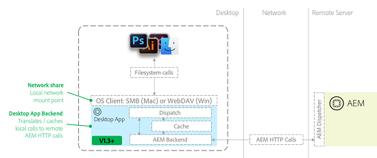

# Solucionar problemas [!DNL Adobe Experience Manager] aplicación de escritorio v1.x {#troubleshoot-aem-desktop-app}

AEM Solucione los problemas de la aplicación de escritorio de la aplicación para resolver los problemas ocasionales relacionados con la instalación, actualización, configuración, etc.

[!DNL Adobe Experience Manager] La aplicación de escritorio incluye utilidades que le ayudan a asignar el repositorio de AEM Assets como un recurso compartido de red en el escritorio (recurso compartido SMB en el sistema operativo Mac). El recurso compartido de red es una tecnología de sistema operativo que permite que los orígenes remotos se traten como si formaran parte del sistema de archivos local de un equipo. AEM En el caso de la aplicación de escritorio, la estructura del repositorio de administración de recursos digitales (DAM) de una instancia de remota se orienta como origen de archivo remoto. En el diagrama siguiente se describe la topología de la aplicación de escritorio:



AEM AEM Con esta arquitectura, la aplicación de escritorio intercepta las llamadas del sistema de archivos (abrir, cerrar, leer, escribir, etc.) al recurso compartido de red montado y las traduce en llamadas HTTP nativas al servidor de. Los archivos se almacenan localmente en caché. Para obtener más información, consulte [AEM Uso de la aplicación de escritorio v1.x](use-app-v1.md).

## AEM información general sobre componentes de aplicaciones de escritorio {#desktop-app-component-overview}

La aplicación de escritorio de incluye los siguientes componentes:

* **La aplicación de escritorio** AEM : la aplicación monta o desmonta DAM como un sistema de archivos remoto y traduce las llamadas al sistema de archivos entre el recurso compartido de red montado localmente y la instancia de red remota a la que se conecta.
* **Sistema operativo Cliente WebDAV/SMB**: administra la comunicación entre el Explorador/Finder de Windows y la aplicación de escritorio. Si se recupera, crea, modifica, elimina, mueve o copia un archivo, el cliente WebDAV/SMB del sistema operativo (SO) comunica esta operación a la aplicación de escritorio. AEM Después de recibir la comunicación, la aplicación de escritorio la traduce a llamadas de API nativas remotas. Por ejemplo, si un usuario crea un archivo en el directorio montado, el cliente WebDAV/SMB inicia una solicitud, que la aplicación de escritorio traduce en una solicitud HTTP que crea el archivo en DAM. El cliente WebDAV/SMB es un componente integrado del sistema operativo. AEM No está afiliado a la aplicación de escritorio, la aplicación de escritorio, el Adobe o la de ninguna manera.
* **Instancia de Adobe Experience Manager**: proporciona acceso a los recursos almacenados en el repositorio DAM de AEM Assets. Además, realiza las acciones solicitadas por la aplicación de escritorio en nombre de las aplicaciones de escritorio locales que interactúan con el recurso compartido de red montado. AEM AEM La instancia de destino debe ejecutar la versión 6.1 o superior de la aplicación AEM AEM Las instancias de que ejecutan versiones anteriores de pueden requerir la instalación de paquetes de funciones y correcciones rápidas adicionales para funcionar por completo.

## AEM Casos de uso previstos para la aplicación de escritorio de {#intended-use-cases-for-aem-desktop-app}

AEM AEM La aplicación de escritorio de utiliza la tecnología de uso compartido de red para asignar un repositorio de remoto a un escritorio local. Sin embargo, no pretende reemplazar a un recurso compartido de red que contiene recursos, donde los usuarios realizan operaciones de administración de recursos digitales directamente desde su equipo de escritorio local. Estos incluyen mover o copiar varios archivos, o arrastrar estructuras de carpetas grandes al recurso compartido de red de AEM Assets directamente en Finder/Explorer.

AEM La aplicación de escritorio de proporciona una forma cómoda de acceder (abrir) y editar (guardar) los recursos DAM entre la interfaz de usuario táctil de AEM Assets y el escritorio local. Vincula los recursos del servidor de AEM Assets con los flujos de trabajo basados en el escritorio.

AEM El siguiente ejemplo de caso de uso ilustra cómo se debe utilizar escritorio de la aplicación de la aplicación de la forma siguiente:

* AEM Un usuario inicia sesión en la interfaz de usuario de la web de y utiliza para localizar un recurso de eVarVarVarVarVarVarVarVarVarVarVarVarVarVarVarVarVarVarVarVarVarVarVarVarVarVarVarVarVarVarVarVarVarVarVarVarVarVarVarVirVarVirVirVirVirVirVirVirVirVirVirVirVirVirVirVirVirVirVirVirVirVirVirVirVirVirVirVirVirVirVirVirVirVirVirVirVirVir
* AEM Mediante las funciones de acción del escritorio de la interfaz de usuario web de la, el usuario abre, muestra o edita el recurso en el escritorio según sea necesario.
* AEM Escritorio abre el recurso en el editor predeterminado para el tipo de archivo del recurso.
* El usuario realiza los cambios deseados en el recurso.
* AEM Una vez modificado un archivo, el usuario puede ver el estado de sincronización del archivo mediante la ventana de estado de sincronización en segundo plano de Escritorio de la aplicación.
* AEM Mediante el menú contextual de Escritorio de la aplicación, el usuario protege o elimina el recurso, o bien vuelve a la interfaz de usuario de DAM.
* AEM Después de completar los cambios en el archivo, el usuario vuelve a la interfaz de usuario web de la

Este no es el único caso de uso. AEM Sin embargo, ilustra cómo el escritorio de la aplicación es un mecanismo cómodo para acceder o editar recursos localmente. Se le recomienda utilizar la interfaz de usuario web de DAM en la medida de lo posible porque ofrece una mejor experiencia. Proporciona al Adobe más flexibilidad para satisfacer los requisitos del cliente.

## Restricciones {#limitations}

El recurso compartido de red WebDAV/SMB1 proporciona la comodidad de trabajar con archivos en una ventana de Explorer/Finder. AEM Sin embargo, Explorer/Finder y los usuarios se comunican a través de una conexión de red que tiene ciertas limitaciones. Por ejemplo, el tiempo empleado para copiar un archivo de 1 GB en el directorio WebDAV/SMB montado es aproximadamente el mismo que el tiempo necesario para cargar un archivo de 1 GB en un sitio web mediante un explorador web. De hecho, en el primer caso, la duración puede ser mayor debido a ineficiencias del protocolo WebDAV/SMB y de los clientes WebDAV/SMB del sistema operativo (especialmente Mac OS X).

Existen limitaciones a los tipos de tareas que se pueden realizar desde un directorio montado. En general, trabajar con archivos grandes, especialmente a través de una conexión de red de baja o baja latencia o baja anchura de banda, puede ser difícil, especialmente cuando se editan archivos grandes.

El Adobe recomienda realizar algunas pruebas de casos de uso antes de confirmar con un cliente que ciertos tipos de archivos se pueden editar de forma eficaz in situ desde el directorio montado.

AEM El escritorio no es adecuado para realizar una manipulación intensiva del sistema de archivos, que incluye, entre otras cosas:

* Mover o copiar archivos y directorios
* AEM Adición de muchos recursos a la
* Buscar y abrir archivos a través del sistema de archivos, excepto para explorar carpetas
* Comprimir o descomprimir archivos de almacenamiento

Debido a limitaciones en el sistema operativo, Windows tiene una limitación de tamaño de archivo de 4.294.967.295 bytes (aproximadamente 4,29 GB). Se debe a una configuración del Registro que define el tamaño que puede tener un archivo en un recurso compartido de red. El valor de la configuración del Registro es un valor DWORD con un tamaño máximo igual al número al que se hace referencia.

[!DNL Experience Manager] la aplicación de escritorio no tiene un valor de tiempo de espera configurable que desconecte la conexión entre [!DNL Experience Manager] servidor y aplicación de escritorio después de un intervalo de tiempo fijo. Al cargar recursos de gran tamaño, si la conexión supera el tiempo de espera después de un tiempo, la aplicación vuelve a intentar cargar el recurso varias veces aumentando el tiempo de espera de carga. No se recomienda ninguna forma de cambiar la configuración de tiempo de espera predeterminada.

## AEM Almacenamiento en caché y comunicación con los {#caching-and-communication-with-aem}

AEM La aplicación de escritorio de ofrece funciones internas de almacenamiento en caché y de carga en segundo plano para mejorar la experiencia del usuario final. Al guardar un archivo grande, primero se guarda localmente para permitirle continuar trabajando. AEM Transcurrido un tiempo (actualmente 30 segundos), el archivo se envía al servidor de en segundo plano.

A diferencia de Creative Cloud Desktop u otras soluciones de sincronización de archivos, como Microsoft One Drive, la aplicación de escritorio de la aplicación de escritorio de la aplicación no es un cliente de sincronización de AEM completo. El motivo es que proporciona acceso a todo el repositorio de AEM Assets, que puede ser extremadamente grande (cientos de gigabytes o terabytes) para una sincronización completa.

El almacenamiento en caché permite limitar la sobrecarga de red/almacenamiento a solo un subconjunto de recursos que son relevantes para el usuario.

>[!CAUTION]
>
>El Adobe recomienda desactivar la generación de miniaturas para que la exploración sea más rápida. Si activa las vistas previas de iconos, la aplicación almacenará en caché los recursos digitales al navegar por la carpeta montada. La aplicación también descarga recursos que puede que no le importen al usuario, lo que añade carga al servidor, consume el ancho de banda del usuario y utiliza más espacio en disco del usuario.

AEM Así es como funciona el almacenamiento en caché de la aplicación de escritorio de:

* Cuando abre una carpeta en Finder y se muestran miniaturas o vistas previas de archivos, o cuando abre un archivo en una aplicación, la aplicación de escritorio almacena en caché el binario del archivo.
* Cuando almacena archivos a través de Finder u otras aplicaciones de escritorio, el archivo se almacena primero localmente (en caché) y se notifica al sistema operativo. A continuación, el archivo se pone en cola para su carga en el servidor en segundo plano y, finalmente, se carga en la red. En caso de error de red, la aplicación de escritorio reintenta cargar todo el archivo durante un máximo de tres veces. Si el archivo no se carga después de tres reintentos, se marca como un archivo en conflicto y el estado se muestra en la ventana Estado de la cola de carga en segundo plano. la aplicación de escritorio ya no intenta actualizar el archivo. El usuario debe actualizar el archivo y volver a cargarlo una vez restaurada la conectividad

Cada operación no se almacena en caché localmente. AEM Los siguientes elementos se transmiten al servidor de la aplicación de forma inmediata sin almacenamiento en caché local:

* Cualquier operación en las carpetas, por ejemplo crear, eliminar, etc
* La funcionalidad Carga de carpetas introducida en la versión 1.4 carga una jerarquía de carpetas local sin almacenar en caché los archivos localmente

## Operaciones individuales {#individual-operations}

Cuando solucione problemas de rendimiento suboptimizado para usuarios individuales, consulte primero [las limitaciones de la aplicación](#limitations). Las secciones siguientes incluyen sugerencias para mejorar el rendimiento de los usuarios individuales.

## Recomendaciones de ancho de banda {#bandwidth-recommendations}

El ancho de banda disponible para un usuario individual desempeña un papel fundamental en el rendimiento del cliente WebDAV/SMB.

El Adobe recomienda que la velocidad de carga de un usuario individual esté cerca de 10 Mbps. En las conexiones inalámbricas, el ancho de banda suele compartirse entre varios usuarios. Si varios usuarios realizan simultáneamente tareas que consumen ancho de banda de la red, el rendimiento puede degradarse aún más. Para evitar estos problemas, utilice una conexión con cable.

<!-- AG, 8/18: The Windows KB article is removed by MS now. Giving 404. Also, Win 7 support is gone and the desktop app is also not supported on Win 7. Hiding this content for now.

## Windows-specific configurations {#windows-specific-configurations}

If you use Experience Manager on Windows, you can configure Windows to enhance the performance of the WebDAV client. For more information, go to [https://support.microsoft.com/en-us/kb/2445570](https://support.microsoft.com/en-us/kb/2445570).

On Windows 7, modifying IE settings can improve the performance of WebDAV. For details, see how to [fix slow WebDAV performance in Windows 7](https://oddballupdate.com/2009/12/fix-slow-webdav-performance-in-windows-7/).
-->

## Operaciones simultáneas {#concurrent-operations}

AEM AEM Cuando interactúa con un archivo localmente, Escritorio comprueba si hay una versión más reciente del archivo disponible en la interfaz de usuario de. Si hay una nueva versión disponible, la aplicación descarga una copia nueva del archivo en la caché local. AEM Sin embargo, si se ha modificado, Escritorio no sobrescribe los archivos almacenados en caché local. Esta función evita que su trabajo se sobrescriba de forma involuntaria.

AEM AEM Cuando se modifica el mismo archivo tanto localmente como en la versión de, la versión modificada localmente sobrescribe la versión de en la versión de la versión de la versión de la versión de la versión de la versión de la versión de la versión de la versión de la versión de la versión de la versión de la versión de la versión de la versión de la versión de la versión de. En este caso, la versión anterior está disponible en la cronología del recurso. Puede verificar ambas versiones y resolver cualquier conflicto.

Si un archivo local no es coherente con la versión disponible en el servidor, el cuadro de diálogo de estado de carga en segundo plano le notificará el conflicto. Para resolver el problema, abra el archivo en conflicto y guárdelo. AEM AEM Al guardar el archivo, se fuerza a que Escritorio sincronice los cambios locales más recientes con los que se ha realizado el. Puede ver las versiones anteriores del recurso en la cronología y resolver cualquier conflicto.

AEM Debe tener en cuenta factores adicionales cuando varios usuarios intenten trabajar en directorios montados separados dirigidos a la misma instancia de la. En particular, son importantes los siguientes factores:

* La cantidad de ancho de banda disponible en la red de origen de los usuarios
* Configuración de red, como servidores de seguridad o proxies, de la red de origen
* AEM Cantidad de ancho de banda disponible en la red de la instancia de la instancia de la objetivo
* AEM Si Dispatcher está presente antes de la instancia de destino de la
* AEM Carga actual en la instancia de destino de la

## AEM Configuraciones adicionales de la {#additional-aem-configurations}

AEM Si el rendimiento de WebDAV/SMB se degrada drásticamente cuando varios usuarios trabajan simultáneamente, puede configurar algunas cosas en la configuración de, lo que puede ayudar a mejorar el rendimiento.

## Actualizar flujos de trabajo transitorios de recursos {#update-asset-transient-workflows}

AEM Puede mejorar el rendimiento en el lado del si habilita flujos de trabajo transitorios para el flujo de trabajo de recursos de actualización de DAM. AEM Al habilitar los flujos de trabajo transitorios, se reduce la potencia de procesamiento necesaria para actualizar los recursos cuando se crean o modifican en el.

1. Vaya a `/miscadmin` en la instancia de Experience Manager (`https://[aem_server]:[port]/miscadmin`).
1. En el árbol de navegación, expanda **Herramientas** > **Flujo de trabajo** > **Modelos** > **Dam**.
1. Doble clic **Recurso de actualización DAM**.
1. En el panel de herramientas flotante, cambie al **Página** y luego haga clic en **Propiedades de página**.
1. Seleccione el **Flujo de trabajo transitorio** y haga clic en **OK**.

### Ajustar cola de flujo de trabajo transitorio de granito {#adjust-granite-transient-workflow-queue}

AEM Otro método para mejorar el rendimiento de la es configurar el valor del máximo de trabajos paralelos para el trabajo de cola de flujo de trabajo transitorio de Granite. El valor recomendado es aproximadamente la mitad del número de CPU disponible con el servidor. Para ajustar el valor, realice estos pasos:

1. Vaya a `/system/console/configMgr` AEM en la instancia de que se va a configurar (por ejemplo, `https://[aem_server]:[port]/system/console/configMgr`).
1. Buscar por `QueueConfiguration`y haga clic en para abrir cada trabajo hasta que encuentre el **Cola de flujo de trabajo transitorio de Granite** y haga clic en **Editar**.
1. Cambie el `Maximum Parallel Jobs` y haga clic en **Guardar**.

## Configuración de AWS {#aws-configuration}

Debido a las limitaciones de ancho de banda de la red, el rendimiento de WebDAV/SMB puede degradarse cuando varios usuarios trabajan simultáneamente. Adobe recomienda aumentar el tamaño de la instancia de AWS AEM para una instancia de destino que se ejecuta en AWS con el fin de mejorar el rendimiento de WebDAV/SMB.

Esta medida aumenta específicamente la cantidad de ancho de banda de red disponible para el servidor. A continuación se muestran algunos detalles:

* La cantidad de ancho de banda de red dedicado a una instancia de AWS aumenta a medida que aumenta el tamaño de la instancia. Para obtener información sobre el ancho de banda disponible para cada tamaño de instancia, consulte [Documentación de AWS](https://aws.amazon.com/ec2/instance-types/).
* Al solucionar problemas de un cliente grande, el Adobe AEM configuraba el tamaño de su instancia de en c4.8xlarge, principalmente para los 4000 Mbps de ancho de banda dedicado que proporciona.
* AEM Si hay un despachante antes de la instancia de la, asegúrese de que sea de tamaño adecuado. AEM Si la instancia de proporciona 4000 Mbps pero el despachante solo proporciona 500 Mbps, el ancho de banda efectivo es solo 500 Mbps. Esto se debe a que Dispatcher crea un cuello de botella en la red.

## Limitaciones de archivos desprotegidos {#checked-out-file-limitations}

Existen algunas limitaciones conocidas en la forma en que puede interactuar con archivos desprotegidos a través de Explorer/Finder. Si un archivo está desprotegido, debe ser de sólo lectura para cualquier usuario, excepto para el usuario que lo tiene desprotegido. AEM La implementación del protocolo WebDAV/SMB1 en aplica esta regla de manera más estricta en la práctica. Sin embargo, los clientes de SO WebDAV/SMB no suelen interactuar correctamente con los archivos desprotegidos. A continuación se describen algunas rarezas.

### General {#general}

AEM Al escribir en un archivo desprotegido, el bloqueo sólo se aplica dentro de la implementación de WebDAV en la que se ha realizado la acción de escribir en un archivo de. En consecuencia, el bloqueo solo lo aplican los clientes que utilizan WebDAV, como la aplicación de escritorio. AEM El bloqueo no se aplica a través de la interfaz web de la aplicación de la interfaz de usuario de. AEM La interfaz de usuario solo muestra un icono de candado en la vista de tarjeta para los recursos que están retirados. AEM El icono es cosmético y no afecta al comportamiento de las personas que lo han hecho con el.

En general, los clientes de WebDAV no siempre se comportan como se espera. Puede haber problemas adicionales. AEM Sin embargo, actualizar o comprobar el recurso en el recurso en el que se encuentra es una forma correcta de comprobar que no se está modificando un recurso. Este comportamiento es típico de los clientes WebDAV del sistema operativo, que no está bajo control del Adobe.

### Windows {#windows}

La eliminación de un archivo parece ser correcta porque el archivo desaparece del explorador de archivos de Windows. AEM Sin embargo, si actualiza el directorio y protege los recursos, se muestra que el archivo sigue presente. Además, la edición de archivos parece ser correcta (no se muestran cuadros de diálogo de advertencia ni mensajes de error). AEM Sin embargo, si se vuelve a abrir el archivo o se registran recursos de la aplicación, se muestra que el archivo no se ha modificado.

#### MAC OS X {#mac-os-x}

AEM Sustituir un archivo no muestra ninguna advertencia ni error, pero al comprobar el recurso en, se muestra que no se ha modificado. AEM Actualice o marque el recurso en la opción para comprobar que no se está modificando.

## Resolución de problemas de iconos de aplicaciones de escritorio (Mac OS X) {#troubleshooting-desktop-app-icon-issues-mac-os-x}

Después de instalar la aplicación de escritorio, el icono de menú de la aplicación de escritorio aparece en la barra de menús. Si el icono no aparece, realice estos pasos para resolver el problema:

1. Abra la ventana de terminal del sistema operativo.
1. Escriba el siguiente comando en el símbolo del sistema y, a continuación, presione Entrar:

   ```shell
    cd ../Library/Caches.
   ```

1. Escriba el siguiente comando y presione Entrar:

   ```shell
   rm -r com.adobe.aem.assetscompanion
   ```

1. Escriba el siguiente comando y presione Entrar:

   ```shell
   cd ~/Library/Preferences
   ```

1. Escriba el siguiente comando y presione Entrar:

   ```shell
   rm com.adobe.aem.assetscompanion.plist
   ```

1. Escriba el siguiente comando y presione Entrar:

   ```shell
   rm ~/Library/Group\ Containers/group.com.adobe.aem.desktop/*
   ```

1. Reinicie el sistema.

AEM El escritorio intenta sincronizar un archivo determinado tres veces. AEM Si el archivo no se sincroniza después del tercer intento, Escritorio considera que el archivo está en conflicto y le notifica mediante la ventana de estado de carga en segundo plano. AEM Un estado de conflicto indica que los cambios más recientes siguen estando disponibles localmente, pero no se sincronizan con el estado de los cambios que se han realizado en el sitio de la aplicación de la aplicación de la aplicación de la aplicación de la aplicación de la aplicación de la aplicación de la aplicación de la aplicación de la aplicación de la. AEM La aplicación de escritorio de ya no intenta sincronizarse.

La forma más sencilla de solucionar esta situación es abrir el archivo en conflicto y guardarlo de nuevo. AEM Obliga a que el escritorio de la aplicación de datos de escritorio de la aplicación intente la sincronización en otras tres ocasiones. Si el archivo sigue sin sincronizarse, consulte las secciones siguientes para obtener más ayuda.

## AEM Borrado de caché de escritorio {#clearing-aem-desktop-cache}

AEM AEM Borrar la caché de Escritorio de la aplicación es una tarea preliminar de resolución de problemas que puede resolver varios problemas de Escritorio de la aplicación de escritorio de la aplicación de la aplicación de escritorio de la.

Puede borrar la caché eliminando el directorio de caché de la aplicación en las ubicaciones siguientes.
En Windows, `%LocalAppData%\Adobe\AssetsCompanion\Cache\`

En Mac, `~/Library/Group/Containers/group.com.adobe.aem.desktop/cache/`

AEM AEM Sin embargo, la ubicación puede cambiar según el punto de conexión de la configuración de la aplicación de escritorio de la aplicación de la. El valor es una versión codificada de la dirección URL de destino. Por ejemplo, si la aplicación tiene como objetivo `http://localhost:4502`, el nombre del directorio es `http%3A%2F%2Flocalhost%3A4502%2F`.

Para borrar la caché, elimine el &lt;encoded aem=&quot;&quot; endpoint=&quot;&quot;> directorio.

>[!NOTE]
>
>AEM AEM Si borra la caché de escritorio de la aplicación, se perderán los cambios en el archivo local que no se sincronizan con la caché de escritorio de la aplicación de la aplicación de escritorio de la aplicación de.

>[!NOTE]
>
>AEM A partir de la versión 1.5 de la aplicación de escritorio de, hay una opción en la interfaz de usuario de la aplicación de escritorio para borrar la caché.

## AEM Búsqueda de la versión de escritorio de {#finding-the-aem-desktop-version}

AEM El procedimiento para determinar la versión de escritorio de la aplicación es el mismo para Windows y para el sistema operativo Mac.

AEM Haga clic en el icono de escritorio de la y, a continuación, seleccione **Acerca de**. El número de versión se muestra en la pantalla.

## AEM Actualización de la aplicación de escritorio de en macOS {#upgrading-aem-desktop-app-on-macos}

AEM Ocasionalmente, pueden producirse problemas al actualizar la aplicación de escritorio de la aplicación de escritorio en macOS. AEM AEM Esto se debe a que la carpeta heredada del sistema para la aplicación de escritorio de la aplicación de escritorio de la aplicación de escritorio de la que se impide que las nuevas versiones de escritorio de la aplicación de escritorio de la se carguen correctamente. Para solucionar este problema, se pueden eliminar manualmente las siguientes carpetas y archivos.

Antes de ejecutar los pasos siguientes, arrastre la aplicación &quot;Adobe Experience Manager Desktop&quot; de la carpeta Aplicaciones macOS a la papelera. A continuación, abra terminal y ejecute el siguiente comando, proporcionando la contraseña cuando se le solicite.

```shell
sudo rm -rf ~/Library/Application\ Support/com.adobe.aem.desktop
sudo rm -rf ~/Library/Preferences/com.adobe.aem.desktop.plist
sudo rm -rf ~/Library/Logs/Adobe\ Experience\ Manager\ Desktop

sudo find /var/folders -type d -name "com.adobe.aem.desktop" | xargs rm -rf
sudo find /var/folders -type d -name "com.adobe.aem.desktop.finderintegration-plugin" | xargs rm -rf
```

## Guardar un archivo desprotegido por otros usuarios {#saving-a-file-checked-out-by-others}

Las limitaciones técnicas del sistema operativo impiden que los usuarios tengan una experiencia coherente al intentar sobrescribir un archivo desprotegido por otros. La experiencia varía en función de la aplicación utilizada para editar el archivo desprotegido. A veces, la aplicación muestra un mensaje de error que indica un error de escritura en disco o un error genérico o aparentemente no relacionado. En otras ocasiones, no se muestra ningún mensaje de error y la operación parece ser correcta.

En este caso, cerrar y volver a abrir el archivo puede revelar que el contenido no ha cambiado. Sin embargo, algunas aplicaciones pueden almacenar una copia de seguridad del archivo para que se puedan aplicar los cambios.

Independientemente del comportamiento, el archivo permanece sin cambios cuando se protege. AEM Incluso si se muestra una versión diferente del archivo, los cambios no se sincronizan con los archivos de la versión de la aplicación de la versión de la aplicación de la versión de la aplicación de la aplicación de la versión de la aplicación de la aplicación de.

## Solución de problemas relacionados con el movimiento de archivos {#troubleshooting-problems-around-moving-files}

La API de servidor requiere que se pasen encabezados adicionales, X-Destination, X-Depth y X-Overwrite, para que funcionen las operaciones de mover y copiar. Dispatcher no pasa estos encabezados de forma predeterminada, lo que provoca que estas operaciones fallen. Para obtener más información, consulte [AEM Conectarse a un grupo de usuarios detrás de un Dispatcher](install-configure-app-v1.md#connect-to-an-aem-instance-behind-a-dispatcher).

## AEM Solución de problemas de conexión de escritorio {#troubleshooting-aem-desktop-connection-issues}

### Problema de redirección de SAML {#saml-redirect-issue}

AEM AEM El motivo más común de los problemas con la conexión de Escritorio de la aplicación a su instancia habilitada para SSO (SAML) es que el proceso de SAML no se redirige de nuevo a la ruta solicitada originalmente. AEM Alternativamente, la conexión se puede redirigir a un host que no esté configurado en el escritorio de la aplicación de la que se dispone en el escritorio de la aplicación. Siga estos pasos para verificar el proceso de inicio de sesión:

1. Abra un navegador web.
1. En la barra de direcciones, especifique la dirección URL `/content/dam.json`.
1. AEM Reemplace la URL por la instancia de destino de la, por ejemplo `https://localhost:4502/content/dam.json`.
1. AEM Inicie sesión en el sitio de.
1. Después de iniciar sesión, compruebe la dirección actual del explorador en la barra de direcciones. Debe coincidir con la dirección URL que introdujo inicialmente.
1. Compruebe que todo lo anterior a `/content/dam.json` AEM AEM coincide con el valor de destino configurado en el escritorio de.

### Problema de configuración SSL {#ssl-configuration-issue}

AEM Las bibliotecas que utiliza la aplicación de escritorio de para la comunicación HTTP utilizan una estricta aplicación SSL. AEM A veces, una conexión puede realizarse correctamente mediante un explorador, pero falla al utilizar la aplicación de escritorio de la aplicación de escritorio de la. Para configurar SSL correctamente, instale el certificado intermedio que falta en Apache. Consulte [Cómo instalar un certificado de CA intermedia en Apache](https://access.redhat.com/solutions/43575).

## AEM Uso del escritorio con Dispatcher {#using-aem-desktop-with-dispatcher}

AEM AEM AEM El escritorio de la aplicación funciona con las implementaciones de la aplicación de la manera más rápida posible, ya que es una configuración predeterminada y recomendada para los servidores de la aplicación de. AEM AEM Los distribuidores de datos de Dispatcher delante de los entornos de creación de la suelen configurarse para omitir el almacenamiento en caché de los recursos DAM. AEM Por lo tanto, los distribuidores no proporcionan almacenamiento en caché adicional desde el punto de vista de escritorio de la. AEM Asegúrese de que la configuración de Dispatcher esté ajustada para funcionar con el escritorio de la. Para obtener más información, consulte [AEM Conectarse a la detrás de un distribuidor](install-configure-app-v1.md#connect-to-an-aem-instance-behind-a-dispatcher).

## Comprobación de archivos de registro {#checking-for-log-files}

AEM Dependiendo del sistema operativo, puede encontrar los archivos de registro para escritorio de la aplicación en las ubicaciones siguientes:

* Windows: `%LocalAppData%\Adobe\AssetsCompanion\Logs`
* Mac: `~/Library/Logs/Adobe\ Experience\ Manager\ Desktop`
