# Uso [!DNL Adobe Experience Manager] aplicación de escritorio {#use-aem-desktop-app-v2}

Utilice el [!DNL Adobe Experience Manager] aplicación de escritorio, para acceder fácilmente a los recursos digitales almacenados en [!DNL Adobe Experience Manager] Repositorio DAM en el escritorio local y utilice estos recursos en cualquier aplicación de escritorio. Puede abrir los recursos en aplicaciones de escritorio y editarlos localmente; vuelva a cargar los cambios en [!DNL Experience Manager] con control de versiones, para compartir las actualizaciones con otros usuarios. También puede cargar nuevos archivos y jerarquías de carpetas en [!DNL Experience Manager], crear carpetas y eliminar recursos o carpetas de [!DNL Experience Manager] DAM.

La integración permite que diversas funciones de la organización administren los recursos de forma centralizada en [!DNL Experience Manager Assets] y para acceder a los recursos del escritorio local en las aplicaciones nativas del sistema operativo Windows o Mac.

Cuando abra la aplicación después de cerrar sesión o por primera vez, proporcione la dirección URL de su [!DNL Experience Manager] servidor con el formato `https://[aem-server-url]:[port]/`. A continuación, seleccione la [!UICONTROL Connect] opción. Proporcione credenciales para conectar la aplicación con el servidor.

Las tareas clave que realiza con el [!DNL Adobe Experience Manager] aplicación de escritorio son:

![Flujos de trabajo y tareas que puede realizar mediante [!DNL Experience Manager] aplicación de escritorio](assets/aem_desktop_app_usecases_v2.png "Flujos de trabajo y tareas que puede realizar mediante [!DNL Adobe Experience Manager] aplicación de escritorio")

Descargar [esta](assets/aem_desktop_app_usecases_print.pdf) archivo de PDF listo para imprimir.

## Cómo funciona la aplicación de escritorio {#how-app-works2}

Antes de empezar a utilizar la aplicación, es necesario que entienda lo siguiente [Funcionamiento de la aplicación](release-notes.md#how-app-works). Además, familiarícese con los siguientes términos:

* **[!UICONTROL Desktop Actions]**: desde la interfaz web de Assets, desde en un explorador, puede explorar las ubicaciones de los recursos o retirarlos y abrirlos para editarlos en la aplicación de escritorio nativa. Estas acciones están disponibles desde la interfaz web y utilizan la funcionalidad de la aplicación de escritorio de. Consulte [Cómo habilitar las acciones de escritorio](using.md#desktopactions-v2).

* El estado del archivo es **[!UICONTROL Cloud Only]**: estos recursos no se descargan en el equipo local y están disponibles en [!DNL Experience Manager] solo servidor de.

* El estado del archivo es **[!UICONTROL Available locally]**: los recursos se descargan y están disponibles en el equipo local tal cual. Los recursos no se cambian.

* El estado del archivo es **[!UICONTROL Edited locally]**: Estos recursos se modifican localmente y los cambios se mantienen en el cargado en [!DNL Experience Manager] servidor. Después de cargar, el estado cambia a [!UICONTROL Available locally]. Consulte [editar recursos](using.md#edit-assets-upload-updated-assets).

* El estado del archivo es **[!UICONTROL Editing conflict]**: Si usted y otros usuarios modifican un recurso simultáneamente, la aplicación indica que se ha producido un conflicto de edición. La aplicación también proporciona opciones para conservar o descartar los cambios. Consulte [cómo evitar conflictos de edición](using.md#adv-workflow-collaborate-avoid-conflicts).

* El estado del archivo es **[!UICONTROL Modified remotely]**: La aplicación indica si un recurso que ha descargado ha cambiado en el [!DNL Experience Manager] servidor. La aplicación también proporciona la opción de descargar la versión más reciente y actualizar la copia local. Consulte [cómo evitar conflictos de edición](using.md#adv-workflow-collaborate-avoid-conflicts).

* **[!UICONTROL Check-out]**: si está editando un archivo o desea editarlo, cambia el estado a desproteger. Añade un icono de candado en el recurso de la aplicación y [!DNL Experience Manager] interfaz web. El icono de bloqueo indica a otros usuarios que eviten editar simultáneamente el mismo recurso, ya que provoca un conflicto de edición.

* **[!UICONTROL Check-in]**: marque el recurso como seguro para que otros usuarios lo editen sin provocar un conflicto de edición. Al cargar los cambios, el icono de candado se elimina automáticamente. Al cambiar el estado de protección, también se elimina el icono de bloqueo, aunque se recomienda no proteger manualmente sin cargar los cambios. Si descarta los cambios, active manualmente la protección.

* **[!UICONTROL Open]** acción: solo tiene que abrir el recurso para previsualizarlo en la aplicación nativa. No se recomienda editar el recurso mediante esta acción, ya que no desprotege el recurso y otros usuarios pueden realizar ediciones que generen conflictos de edición.

* **[!UICONTROL Edit]** action: Utilice la acción para modificar la imagen. Clic [!UICONTROL Edit] esta acción extrae automáticamente el recurso y añade un icono de bloqueo en él. Después de hacer clic en Editar, si no desea editar el recurso, haga clic en [!UICONTROL Toggle check-in]. Para eliminar, cambiar el nombre o mover recursos en [!DNL Experience Manager] Jerarquía de carpetas DAM, use [!DNL Experience Manager] acciones de la interfaz web y no la acción de edición.

* **[!UICONTROL Download]** Acción: descargue el recurso en el equipo local. Puede descargar los recursos ahora y editarlos más tarde; trabaje sin conexión y cargue los cambios más tarde. Los recursos se descargan en una carpeta de caché del sistema de archivos.

* **[!UICONTROL Reveal File]** o **[!UICONTROL Reveal Folder]** acción: mientras los recursos se descargan en una carpeta de caché local, la aplicación imita una unidad de red local y proporciona una ruta de acceso local para cada recurso. Para conocer esta ruta, utilice la opción de visualización adecuada en la aplicación. La acción Mostrar es necesaria para colocar recursos en la aplicación de Creative Cloud. Consulte [colocar recursos](using.md#place-assets-in-native-documents).

* **[!UICONTROL Open In Web]** acción: Para ver el recurso en [!DNL Experience Manager] interfaz web, ábrala en la web. Puede iniciar más flujos de trabajo desde [!DNL Experience Manager] interfaz como actualizar metadatos o descubrir recursos.

* **[!UICONTROL Delete]** acción: Eliminar el recurso de [!DNL Experience Manager] Repositorio DAM. La acción elimina la copia original del recurso en el servidor del Experience Manager. Si solo desea descartar las modificaciones realizadas en el recurso local, consulte [descartar cambios](using.md#edit-assets-upload-updated-assets).

* **[!UICONTROL Upload Changes]**: la aplicación de escritorio carga el recurso actualizado solo cuando se carga explícitamente en [!DNL Experience Manager] servidor. Al guardar las ediciones, los cambios se guardan únicamente en el equipo local. Al cargar, el recurso se registra automáticamente y se elimina el icono de bloqueo. Consulte [editar recursos](using.md#edit-assets-upload-updated-assets).

## Habilitar acciones de escritorio en [!DNL Experience Manager] interfaz web {#desktopactions-v2}

Desde dentro de [!DNL Assets] interfaz de usuario en un explorador, puede explorar las ubicaciones de los recursos o retirarlos y abrirlos para editarlos en la aplicación de escritorio. Estas opciones se denominan [!UICONTROL Desktop Actions] y no están habilitadas de forma predeterminada. Para habilitarlo, siga estos pasos.

1. En el [!DNL Assets] consola, haga clic en **[!UICONTROL User]** de la barra de herramientas.
1. Clic **[!UICONTROL My Preferences]** para mostrar el **[!UICONTROL Preferences]** diálogo.

1. En el [!UICONTROL User Preferences] diálogo, seleccione **[!UICONTROL Show Desktop Actions For Assets]**, luego haga clic en **[!UICONTROL Accept]**.

   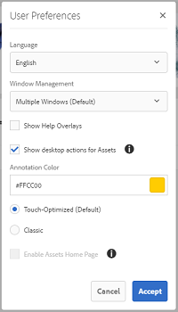

   *Figura: Seleccionar [!UICONTROL Show Desktop Actions For Assets] para habilitar las acciones de escritorio.*

## Examinar, buscar y previsualizar recursos {#browse-search-preview-assets}

Puede buscar, buscar y previsualizar los recursos disponibles en la [!DNL Experience Manager] repositorio, todo desde la aplicación de escritorio. Pruebe lo siguiente en la aplicación:

1. Vaya a una carpeta y vea información básica de los recursos disponibles en ella, junto con miniaturas pequeñas de todos los recursos.

   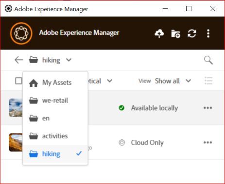

1. Para ver más información y una miniatura más grande de un recurso individual, haga clic en el nombre del archivo.

   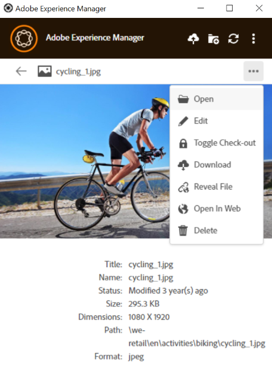

1. Clic **[!UICONTROL Open]** o **[!UICONTROL Edit]** para descargar el archivo localmente y solo verlo o editarlo en la aplicación nativa, respectivamente.
1. Busque mediante palabras clave para encontrar un recurso relacionado en la [!DNL Experience Manager] repositorio. Uso `?` y `*` como caracteres comodín. Estos caracteres comodín sustituyen a un solo carácter o a varios, respectivamente. Filtre y ordene los resultados según sea necesario.

   

   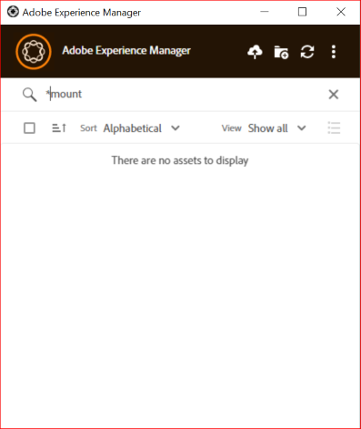

>[!NOTE]
>
>La aplicación muestra los recursos haciendo coincidir los criterios de búsqueda en varios campos de metadatos, y no solo el título del recurso o el nombre del archivo.

## Descarga de recursos {#download-assets}

Puede descargar los recursos en su sistema de archivos local. La aplicación recupera los recursos de [!DNL Experience Manager] y guarda la misma copia en el sistema de archivos local.

Clic  para ver las opciones y haga clic en  para descargar.

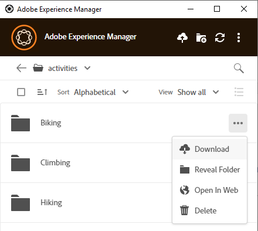

>[!NOTE]
>
>Al descargar o cargar un archivo grande o varios archivos, la aplicación desactiva las acciones en recursos y carpetas. Las acciones están disponibles cuando se completa la descarga o la carga.

La descarga de varios recursos puede provocar un rendimiento deficiente si el tamaño de la cola es grande o si se enfrenta a algún problema de red. Además, puede poner en cola, sin saberlo, muchos recursos para su descarga al descargar una carpeta. Para evitar tiempos de espera largos, la aplicación restringe el número de recursos descargados de una sola vez. Para saber cómo configurarlo, consulte [Definir preferencias](install-upgrade.md#set-preferences). Incluso por debajo de este límite, la aplicación a veces puede solicitar una confirmación antes de descargar una carpeta aparentemente grande.

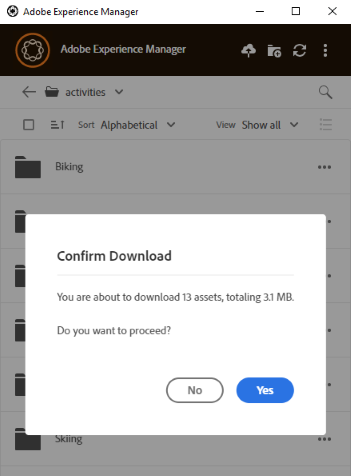

Si se seleccionan y descargan carpetas, la aplicación solo descarga los recursos almacenados directamente en las carpetas en [!DNL Experience Manager]. No descarga automáticamente recursos de subcarpetas.

## Abrir recursos en el escritorio {#openondesktop-v2}

Puede abrir los recursos remotos para verlos en la aplicación nativa. Los recursos se descargan en una carpeta local y se inician en la aplicación nativa asociada al formato de archivo. Puede cambiar la aplicación nativa para abrir tipos de archivo específicos (extensiones) en Mac o Windows.

Clic **[!UICONTROL Open]** en el menú recurso. El recurso se descarga localmente y se abre en la aplicación nativa. Compruebe el progreso de descarga y la velocidad de transferencia de recursos grandes en la barra de estado.

<!-- 
-->

>[!NOTE]
>
>Si los cambios esperados no se reflejan en la aplicación, haga clic en el icono de actualización  o haga clic con el botón derecho en la interfaz de la aplicación y seleccione **[!UICONTROL Refresh]**. Las acciones no están disponibles mientras haya descargas o cargas más grandes en curso.

Para abrir la carpeta de descarga local de un recurso, haga clic en  y haga clic en  **[!UICONTROL Reveal File]** acción.

## Uso o colocación de recursos en documentos nativos {#place-assets-in-native-documents}

En algunos casos, por ejemplo, al colocar un recurso en un documento nativo, se accede a un archivo en el Explorador de Windows o en el Buscador de Mac. Para llegar a la ubicación del sistema de archivos del archivo descargado localmente, utilice el  **[!UICONTROL Reveal File]** opción.

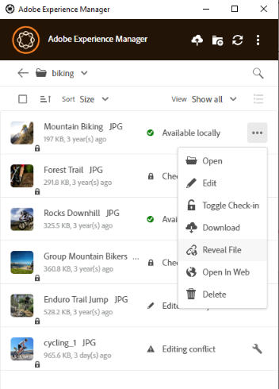

Clic **[!UICONTROL Reveal File]**, o **[!UICONTROL Reveal Folder]** en una carpeta, para abrir el Explorador de Windows o el Buscador de Mac con el archivo o la carpeta preseleccionados en el equipo local. La opción resulta útil para, por ejemplo, colocar el [!DNL Experience Manager] archivos en las aplicaciones nativas que admiten la colocación o vinculación de archivos locales. Para ver cómo colocar archivos en Adobe InDesign, consulte [Colocación de gráficos](https://helpx.adobe.com/indesign/using/placing-graphics.html).

El **[!UICONTROL Reveal File]** La acción abre un recurso compartido de red local, que muestra solo los recursos disponibles localmente, es decir, muestra los recursos que se mostraron, descargaron o abrieron o editaron mediante la aplicación. El recurso compartido de red local no carga ningún cambio en [!DNL Experience Manager]. Para cargar los cambios, utilice explícitamente **[!UICONTROL Upload Changes]** o **[!UICONTROL Upload]** acciones en la aplicación.

>[!NOTE]
>
>Para la compatibilidad con versiones anteriores [!DNL Experience Manager] aplicación de escritorio v1.x, los archivos mostrados se proporcionan desde un recurso compartido de red local, exponiendo solo los archivos disponibles localmente. Las rutas de escritorio de los archivos revelados son las mismas que las creadas por la aplicación v1.x.

>[!CAUTION]
>
>No use **[!UICONTROL Reveal File]** opción para editar recursos en aplicaciones nativas. En su lugar, utilice el **[!UICONTROL Edit]** acciones. Para obtener más información, consulte [Flujo de trabajo avanzado: colaborar en los mismos archivos y evitar conflictos de edición](#adv-workflow-collaborate-avoid-conflicts).

## Editar recursos y cargar recursos actualizados en [!DNL Experience Manager] {#edit-assets-upload-updated-assets}

Abra los recursos para editarlos cuando desee realizar cambios y cargar los recursos actualizados en el servidor de AEM Experience Manager. Para evitar conflictos con ediciones de otros usuarios, utilice la aplicación para iniciar una sesión de edición. Antes de empezar a editar, asegúrese de que el recurso no tenga un icono de bloqueo, es decir, que otro usuario no esté editando el recurso.

Para editar un recurso, búsquelo o vaya a la ubicación del recurso. Clic  y haga clic en **[!UICONTROL Edit]**.

Uso **[!UICONTROL Toggle Check-out]** para bloquear el recurso y evitar conflictos con ediciones de otros usuarios en las dos situaciones siguientes:

* Ha empezado a editar un recurso sin desprotegerlo primero (por ejemplo, abriéndolo).
* Tiene intención de empezar a editar un recurso pronto y no desea que otros lo editen.

Una vez que haya terminado de realizar las ediciones, la aplicación muestra el **[!UICONTROL Edited Locally]** estado de los recursos modificados. Todos los cambios guardados en los recursos son de solo local hasta que cargue los cambios en [!DNL Experience Manager]. Para cargar un individuo o algunos recursos uno por uno, haga clic en **[!UICONTROL Upload Changes]** en las opciones de un recurso. Crea una versión del recurso en [!DNL Experience Manager]. Uso de la interfaz web de [!DNL Assets], puede ver el historial de recursos en la [Vista Cronología](https://experienceleague.adobe.com/docs/experience-manager-65/assets/using/activity-stream.html).

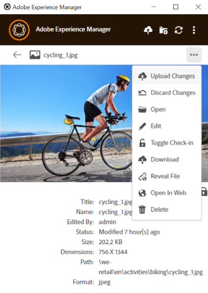

Para conocer las prácticas recomendadas en la edición colaborativa, consulte [Flujo de trabajo avanzado: colaborar en los mismos archivos y evitar conflictos de edición](#adv-workflow-collaborate-avoid-conflicts).

En los casos siguientes, es posible que desee descartar los cambios y ediciones realizados en el recurso local. Haga clic en **[!UICONTROL Discard Changes]**.

* Si no desea guardar los cambios locales en [!DNL Experience Manager].
* Empiece a realizar cambios en el recurso original después de guardar algunos cambios.
* Deje de editar el recurso, ya que ya no es necesario.

Si es necesario, cambie la desprotección. El recurso actualizado se eliminará de la carpeta de caché local y se descargará de nuevo cuando lo edite o abra.

## Carga y adición de nuevos recursos a [!DNL Experience Manager] {#upload-and-add-new-assets-to-aem}

Los usuarios pueden agregar nuevos recursos al repositorio de DAM. Por ejemplo, puede ser un fotógrafo o contratista de una agencia que desee agregar un gran número de fotos de una sesión de fotos a la [!DNL Experience Manager] repositorio. Para agregar contenido nuevo a [!DNL Experience Manager], seleccione  en la barra superior de la aplicación. Busque los archivos de recursos en el sistema de archivos local y haga clic en **[!UICONTROL Select]**. Como alternativa, para cargar recursos, arrastre los archivos o carpetas a la interfaz de la aplicación. En Windows, si arrastra recursos a una carpeta dentro de la aplicación, estos se cargarán en la carpeta. Si tarda más en cargarse, la aplicación muestra una barra de progreso.

<!-- 
-->

Puede cargar carpetas o archivos individuales desde el sistema de archivos local. La jerarquía de una carpeta se conserva cuando se carga. Antes de cargar recursos de forma masiva, consulte [Cargas masivas](#bulk-upload-assets).

Para ver la lista de activos transferidos en una sesión determinada, haga clic en **[!UICONTROL View]** > **[!UICONTROL Assets transfers]**. La lista le permite ver y comprobar rápidamente las transferencias de archivos de la sesión actual.

Puede controlar la concurrencia de carga (aceleración) en **[!UICONTROL Preferences]** > **[!UICONTROL Upload acceleration]** configuración. Una mayor concurrencia suele proporcionar cargas más rápidas, pero puede consumir muchos recursos y consumir más potencia de procesamiento del equipo local. Si experimenta un sistema lento, vuelva a intentar la carga con un valor inferior de concurrencia.

>[!NOTE]
>
>La lista de transferencias no es persistente y no está disponible si sale de la aplicación y la vuelve a abrir.

### Administrar caracteres especiales en los nombres de recursos {#special-characters-in-filename}

En la aplicación heredada, los nombres de nodo creados en el repositorio conservaban los espacios y mayúsculas y minúsculas de los nombres de carpeta proporcionados por el usuario. Para que la aplicación actual emule las reglas de nomenclatura de nodos de la aplicación v1.10, habilite [!UICONTROL Use legacy conventions when creating nodes for assets and folders] en el [!UICONTROL Preferences]. Consulte [preferencias de aplicación](/help/using/install-upgrade.md#set-preferences). Esta preferencia heredada está desactivada de forma predeterminada.

>[!NOTE]
>
>La aplicación solo cambia los nombres de nodo en el repositorio mediante las siguientes convenciones de nomenclatura. La aplicación conserva el `Title` del recurso tal cual.

<!-- TBD: Do NOT use this table.

| Where do characters occur | Characters | Legacy preference | Renaming convention | Example |
|---|---|---|---|---|
| In file name extension | `.` | Enabled or disabled | Retained as is | NA |
| File or folder name | `. / : [ ] | *` | Enabled or disabled | Replaced with a `-` (hyphen) | `myimage.jpg` remains as is and `my.image.jpg` changes to `my-image.jpg`. |
| Folder name | `% ; # , + ? ^ { } "` | Disabled | Replaced with a `-` (hyphen) | tbd |
| File name | `% # ? { } &` | Disabled | Replaced with a `-` (hyphen) | tbd |
| File name | Whitespaces | Enabled or disabled | Retained as is | NA |
| Folder name | Whitespaces | Disabled | Replaced with a `-` (hyphen) | tbd |
| File name | Uppercase characters | Disabled | Retained as is | tbd |
| Folder name | Uppercase characters | Disabled | Replaced with a `-` (hyphen) | tbd |
-->

| Caracteres ‡ | Preferencia heredada en la aplicación | Cuando se produce en nombres de archivo | Cuando se produce en nombres de carpeta | Ejemplos |
|---|---|---|---|---|
| `. / : [ ] \| *` | Habilitado o deshabilitado | Reemplazado por `-` (guion). A `.` (punto) en la extensión de nombre de archivo se conserva tal cual. | Reemplazado por `-` (guion). | `myimage.jpg` permanece tal cual y `my.image.jpg` cambios en `my-image.jpg`. |
| `% ; # , + ? ^ { } "` y espacios en blanco |  Desactivado | Se conservan los espacios en blanco | Reemplazado por `-` (guion). | `My Folder.` cambios en `my-folder-`. |
| `# % { } ? & .` |  Desactivado | Reemplazado por `-` (guion). | NO. | `#My New File.` cambios en `-My New File-`. |
| Caracteres en mayúsculas |  Desactivado | La carcasa se conserva tal cual. | Se ha cambiado a minúsculas. | `My New Folder` cambios en `my-new-folder`. |
| Caracteres en mayúsculas |  Habilitado | La carcasa se conserva tal cual. | La carcasa se conserva tal cual. | NO. |

‡ La lista de caracteres es una lista separada por espacios en blanco.

<!-- TBD: Check if the following is to be included in the footnote.

Do not use &#92;&#92; in the names of files and &#92;&#116; &#38; in the names of folders. 
-->

<!-- TBD: Securing the below presentation of the same content in a comment.

**File names**

| Characters | Replaced by |
|---|---|
| &#35; &#37; &#123; &#63; &#125; &#38; &#46; &#47; &#58; &#91; &#124; &#93; &#42; | hyphen (-) |
| whitespaces | whitespaces are retained |
| capital case | casing is retained |

>[!CAUTION]
>
>Avoid using &#92;&#92; in file names.

**Folder names**

| Characters | Replaced by |
|---|---|
| Characters | Replaced by |
| &#37; &#59; &#35; &#44; &#43; &#63; &#94; &#123; &#123; &#34; &#46; &#47; &#59; &#91; &#93; &#124; &#42; | hyphen (-) |
| whitespaces | hyphen (-) |
| capital case | lower case |

>[!CAUTION]
>
>Avoid using &#92;&#92; &#92;&#116; &#38; in folder names.

>[!NOTE]
>
>If you enable [!UICONTROL Use legacy conventions when creating nodes for assets and folders] in app [!UICONTROL Preferences], then the app emulates v1.10 app behavior when uploading folders. In v1.10, the node names created in the repository respect spaces and casing of the folder names provided by the user. For more information, see [app Preferences](/help/using/install-upgrade.md#set-preferences).

-->

## Trabajo con varios recursos {#work-with-multiple-assets}

Los usuarios pueden trabajar con varios recursos y administrarlos fácilmente mediante acciones como cargar todas las ediciones de una sola vez o cargar carpetas anidadas en unos pocos clics.

### Examen de carpetas grandes {#browse-large-folders}

Cuando trabaje con carpetas que contengan muchos recursos, desplácese para ver más recursos. Para desplazarse con el teclado, pulse la tecla TAB varias veces para seleccionar el recurso en la parte superior. Observe el recurso resaltado para saber cuándo está seleccionado. Ahora utilice la tecla Flecha abajo para desplazarse por la lista de recursos.

### Acciones rápidas para los recursos seleccionados {#quick-actions-for-selected-assets}

Haga clic en la miniatura de algunos recursos para seleccionarlos. Para seleccionar todos los recursos, haga clic en la casilla de verificación situada en la barra superior de la aplicación. El conjunto de acciones aplicables a todos los recursos seleccionados de forma colectiva se muestra en una barra de herramientas en la parte inferior de la aplicación.

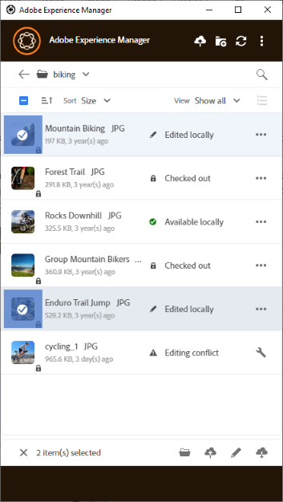

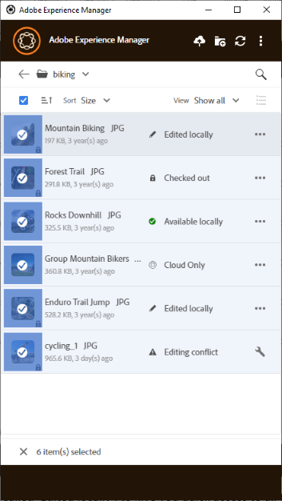

Las acciones disponibles en la barra de herramientas de la parte inferior dependen del estado de los archivos seleccionados. Por ejemplo, si solo selecciona **[!UICONTROL Edited Locally]** archivos, verá **[!UICONTROL Upload Changes]** icono. Si selecciona una combinación de **[!UICONTROL Edited locally]** y **[!UICONTROL Cloud only]**, el **[!UICONTROL Upload Changes]** La acción no está disponible.

### Buscar todas las imágenes editadas {#find-all-edited-images}

La aplicación proporciona una vista, llamada **[!UICONTROL Edited locally]**, para que pueda acceder rápidamente a todos los archivos que ha descargado localmente (a través de [!UICONTROL Open] o [!UICONTROL Edit] acciones) y luego se modifica. La aplicación le permite seleccionar todos los recursos editados localmente y cargar los cambios en unos pocos clics. Esta vista también muestra los recursos editados localmente que tienen un conflicto de edición.

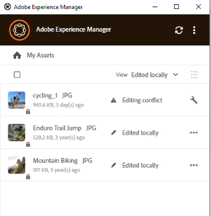

### Carga masiva de recursos {#bulk-upload-assets}

Los usuarios u organizaciones, como los fotógrafos o las agencias creativas, pueden crear numerosos recursos locales en escenarios como sesiones de fotos, retoques o selecciones de un conjunto más grande realizado fuera [!DNL Experience Manager]. Pueden cargar estas carpetas locales grandes en [!DNL Assets] directamente desde la aplicación de escritorio. Las jerarquías de carpetas se conservan y se cargan todas las subcarpetas anidadas y los recursos incluidos. Los recursos cargados también están disponibles inmediatamente para otros usuarios del mismo servidor para su consumo. Los recursos se cargan en segundo plano, por lo que la operación no está vinculada a una sesión del explorador web.

![Cargar varias carpetas locales del escritorio a [!DNL Experience Manager]](assets/upload_local_folders_da2.png "Carga masiva de varias carpetas locales desde el escritorio al Experience Manager")

Después de la carga, si los cambios esperados no se reflejan en la aplicación, haga clic en el icono de actualización .

>[!NOTE]
>
>No utilice la funcionalidad de carga para migrar recursos de dos en dos [!DNL Experience Manager] implementaciones. En su lugar, consulte la [guía de migración](https://experienceleague.adobe.com/docs/experience-manager-65/assets/administer/assets-migration-guide.html).

### Lista de activos transferidos {#list-of-transferred-assets}

Para ver la lista de activos transferidos en una sesión determinada, consulte [Cargar recursos en [!DNL Experience Manager]](#upload-and-add-new-assets-to-aem).

## Flujo de trabajo avanzado: comience desde el [!DNL Assets] interfaz web {#adv-workflow-start-from-aem-ui}

Si es necesario, inicie el flujo de trabajo desde la interfaz web de Assets. La aplicación de escritorio se integra con [!DNL Experience Manager] para asumir el control cuando se solicite mediante acciones de escritorio.

Un caso especial de inicio del flujo de trabajo desde la interfaz web es la detección de recursos. La barra Omnisearch de la interfaz de usuario de Assets ofrece una experiencia de búsqueda enriquecida y avanzada. Primero debe localizar un recurso deseado en la web y luego iniciar el flujo de trabajo en la aplicación mediante [!UICONTROL Desktop Actions]. Algunos casos de ejemplo incluyen el filtrado de resultados de búsqueda mediante facetas, la localización de un recurso específico con licencia de Adobe Stock o una personalización implementada por su organización que le permite un mejor descubrimiento desde la interfaz web.

La funcionalidad de la aplicación de escritorio se utiliza al intentar las siguientes acciones en la interfaz web de Assets:

* El [!UICONTROL Desktop Actions] que permite [!UICONTROL Open], [!UICONTROL Edit], y [!UICONTROL Reveal]
* [!UICONTROL Upload folder]
* [!UICONTROL Check-out] o [!UICONTROL check-in]

Por ejemplo, las acciones de la interfaz web disponibles para un recurso extraído en la aplicación son las siguientes [!UICONTROL Open], [!UICONTROL Reveal], y [!UICONTROL Check-in].

![Acciones de escritorio en [!DNL Experience Manager] interfaz web](assets/assets_web_actions_da2.png "Acciones de escritorio en la interfaz web del Experience Manager")

>[!NOTE]
>
>El explorador puede solicitarle que permita el inicio de [!DNL Adobe Experience Manager] Escritorio. Para disfrutar de una transferencia ininterrumpida del explorador a la aplicación, active la casilla de verificación adecuada para permitir que la aplicación siempre se haga cargo.

No puede encontrar la siguiente información o flujo de trabajo mediante la interfaz web. Utilice la aplicación de escritorio, ya que la interfaz web no realiza un seguimiento de los cambios locales y no tiene en cuenta lo siguiente:

* Archivos editados localmente.
* Archivos que tienen un conflicto de edición y una forma de resolverlo.
* Cargar cambios locales en [!DNL Experience Manager].
* Varios estados de los archivos disponibles localmente.

Por el contrario, puede abrir el recurso en la interfaz web desde la aplicación de escritorio de mediante **[!UICONTROL Open In Web]** acción.

## Flujo de trabajo avanzado: colaborar en los mismos archivos y evitar conflictos de edición {#adv-workflow-collaborate-avoid-conflicts}

En entornos de colaboración, es posible que varios usuarios trabajen en el mismo conjunto de recursos que pueden provocar conflictos de versiones. Para evitar conflictos, siga estas prácticas recomendadas:

* No edite ningún recurso haciendo clic en [!UICONTROL Open]. No edite los recursos descargados localmente abriéndolos desde la carpeta del sistema de archivos. Otros usuarios no saben que el recurso se está editando.
* Para editar un recurso, haga clic siempre en [!UICONTROL Edit]. Abre el recurso en la aplicación nativa y agrega un icono de candado en el recurso, para que los demás usuarios sepan que el recurso se está editando.
* Clic [!UICONTROL Toggle Check-in] si empieza a editar accidentalmente sin hacer clic en [!UICONTROL Edit]. Esto agrega un icono de bloqueo al recurso. Incluso si planea editar un recurso más tarde pero desea evitar que otros lo editen, haga clic en [!UICONTROL Toggle Check-in] para bloquear el recurso.
* Antes de editar un recurso, asegúrese de que otros usuarios no lo estén editando. Busque el icono de bloqueo en el recurso.
* Después de completar las ediciones, cargue todos los cambios y, a continuación, proteja el recurso.

Si se actualiza un recurso descargado localmente en la [!DNL Experience Manager] servidor, la aplicación muestra un **[!UICONTROL Modified remotely]** estado. Puede quitar la copia local o actualizar la copia local haciendo clic en [!UICONTROL Remove] o [!UICONTROL Update] respectivamente. Los vínculos del cuadro de diálogo permiten ver ambas versiones del recurso.

Si un recurso que está editando localmente también se actualiza en el servidor sin su conocimiento, la aplicación muestra un **[!UICONTROL Editing Conflict]** estado. Puede conservar un conjunto de cambios: o bien conservar las actualizaciones (haga clic en **[!UICONTROL Keep Mine]**) y elimine las actualizaciones del otro usuario, edite o respete las del otro usuario y elimine las suyas (**[!UICONTROL Overwrite Mine]**).

## Flujo de trabajo avanzado: colocar y vincular recursos en un archivo de InDesign {#adv-workflow-place-assets-indesign}

Cuando se usa [!DNL Experience Manager] aplicación de escritorio para abrir archivos con recursos vinculados, los recursos se descargan previamente y aparecen colocados en las aplicaciones nativas. Para que este flujo de trabajo funcione, la aplicación nativa debe admitir la colocación de vínculos a recursos locales y [!DNL Experience Manager] debe admitir la resolución de estos vínculos en los archivos binarios a referencias del lado del servidor.

[!DNL Experience Manager] la aplicación de escritorio de admite este flujo de trabajo con algunas aplicaciones de escritorio y formatos de archivo de Adobe Creative Cloud seleccionados: Adobe InDesign, Adobe Illustrator y Adobe Photoshop. El flujo de trabajo le permite trabajar de forma eficaz con los archivos de Creative Cloud admitidos. Por lo tanto, si el usuario A coloca algunos recursos en un archivo de InDesign y lo registra en [!DNL Experience Manager], el usuario B verá los recursos en el archivo de InDesign aunque no formen parte del archivo. Los recursos se descargan localmente en el equipo del usuario B.

>[!NOTE]
>
>La aplicación de escritorio puede asignarse a cualquier unidad de Windows. Sin embargo, para que las operaciones se realicen sin problemas, no cambie la letra de unidad predeterminada. Si los usuarios de la misma organización utilizan letras de unidad diferentes, no pueden ver los recursos colocados por otros. Los recursos colocados no se recuperan a medida que cambia la ruta. Los recursos colocados siguen colocados en el archivo binario (por ejemplo, INDD) y no se eliminan.

Para conocer las limitaciones de este flujo de trabajo, consulte las [requisitos del sistema y versiones compatibles](release-notes.md).

Para probar este flujo de trabajo con un recurso de imagen y un InDesign, siga estos pasos:

1. Mantenga a mano un archivo INDD con recursos colocados en [!DNL Experience Manager]. Para obtener información sobre cómo crear un archivo INDD de este tipo, consulte [Colocación de gráficos](https://helpx.adobe.com/indesign/using/placing-graphics.html).
1. Desde la aplicación de escritorio, **[!UICONTROL Edit]** el archivo INDD con recursos colocados en [!DNL Experience Manager].
1. La aplicación descarga tanto el archivo de InDesign como los recursos vinculados. Cuando InDesign abre el documento, los vínculos se resuelven, los recursos se descargan y los recursos se muestran en el documento de InDesign.
1. Para colocar un nuevo gráfico en el fichero de InDesign, utilice **[!UICONTROL Reveal File]** acción en el recurso. La acción descarga el recurso localmente y abre la ubicación del recurso compartido de red local en el Explorador de Windows o el Buscador de Mac.
1. Coloque el recurso mostrado en el documento de InDesign. Esto crea un vínculo en el documento.
1. Una vez completadas las ediciones en el documento de InDesign, guárdelo y cárguelo en [!DNL Experience Manager] uso de la aplicación de escritorio.

## Flujo de trabajo avanzado: descargar los recursos localmente {#adv-workflow-download-assets-locally}

La aplicación descarga los recursos de [!DNL Experience Manager] servidor localmente en el sistema de archivos en muchos casos. Las descargas consumen ancho de banda y espacio en disco. Conocer los escenarios le ayuda a optimizar el tiempo de espera para que se completen las descargas.

Los recursos se descargan desde la aplicación bajo demanda. Consulte [Descarga de recursos](#download-assets).

Cuando se usa la variable [!UICONTROL Open] acción para abrir un recurso en una aplicación de escritorio nativa, el recurso se descarga localmente si no está disponible localmente. Consulte [Abrir recursos](#openondesktop-v2).

Al revelar la ubicación de un recurso o una carpeta desde la aplicación, el recurso o la carpeta primero se descargan localmente y, a continuación, se abren en el equipo en el recurso compartido de red local. Consulte [Abrir recursos](#openondesktop-v2).

Cuando se usa la variable [!UICONTROL Edit] acción para editar un recurso en una aplicación de escritorio nativa, el recurso se descarga localmente si no está disponible localmente. Consulte [Editar recursos y cargar recursos actualizados en [!DNL Experience Manager]](#edit-assets-upload-updated-assets).

Si la aplicación está instalada y tiene permiso para hacerlo, completa las acciones cuando utiliza [!UICONTROL Desktop Actions] de [!DNL Experience Manager] interfaz web. La aplicación descarga primero el recurso y, a continuación, completa la acción.
